# Job Posting Platform - Architecture (PPT Version)

## 1. System Overview

## 2. Application Architecture

```mermaid
graph LR
    subgraph "Pages"
        Home[🏠 Home]
        Jobs[💼 Jobs]
        Dashboard[📊 Dashboard]
    end

    subgraph "API Layer"
        JobAPI[Jobs API]
        AppAPI[Applications API]
        UserAPI[Users API]
    end

    subgraph "Database"
        Users[(Users)]
        JobsDB[(Jobs)]
        Apps[(Applications)]
    end

    Home --> JobAPI
    Jobs --> JobAPI
    Dashboard --> JobAPI
    Dashboard --> AppAPI

    JobAPI --> JobsDB
    AppAPI --> Apps
    UserAPI --> Users

    JobsDB -.ref.-> Users
    Apps -.ref.-> JobsDB
    Apps -.ref.-> Users
```

## 3. Tech Stack

## 4. User Flow

## 5. Database Schema

## 6. Features

## 7. Security & Auth

---

## Quick Stats

| Component | Technology |
|-----------|-----------|
| **Frontend** | Next.js 15 + React 19 |
| **Styling** | Tailwind CSS + Ant Design |
| **Backend** | Next.js API Routes |
| **Database** | MongoDB Atlas |
| **Auth** | Clerk |
| **Deployment** | Vercel |
| **Email** | Gmail SMTP |

## Key Features

✅ Job Posting & Management
✅ Application Tracking System
✅ Role-Based Access (Job Seeker, Recruiter)
✅ Email Notifications
✅ Advanced Search & Filters
✅ Responsive Design
✅ Real-time Application Status

---

**Platform Type**: Full-Stack Job Portal
**Architecture**: Monolithic Next.js App
**Deployment**: Cloud-Based (Vercel + MongoDB Atlas)
