# Job Posting Platform - Architecture Diagram

## Option 1: Clean & Professional

```mermaid
flowchart TB
    subgraph Users["👥 USER LAYER"]
        direction LR
        JS[("👨‍💼 Job Seekers<br/>Browse & Apply")]
        RC[("👔 Recruiters<br/>Post & Manage")]
    end

    subgraph Frontend["🎨 PRESENTATION LAYER"]
        direction TB
        Pages["📄 Pages<br/>Home | Jobs | Dashboard"]
        Components["🧩 Components<br/>JobCard | Filters | Forms"]
        Pages --> Components
    end

    subgraph Auth["🔐 AUTHENTICATION"]
        Clerk["🔑 Clerk Auth<br/>JWT | OAuth"]
    end

    subgraph Backend["⚙️ APPLICATION LAYER"]
        direction TB
        API["🔌 REST API"]
        Logic["💡 Business Logic"]
        API --> Logic
    end

    subgraph Data["💾 DATA LAYER"]
        direction TB
        DB[("🗄️ MongoDB Atlas<br/>Users | Jobs | Applications")]
    end

    subgraph External["📧 EXTERNAL SERVICES"]
        Email["✉️ Email Service<br/>Notifications"]
    end

    JS -.browse.-> Frontend
    RC -.manage.-> Frontend

    Frontend <-->|Auth Check| Auth
    Frontend -->|API Calls| Backend

    Auth -.webhook.-> Data
    Backend <-->|CRUD| Data
    Backend -->|Send| External

    classDef userStyle fill:#667eea,stroke:#764ba2,stroke-width:3px,color:#fff
    classDef frontStyle fill:#f093fb,stroke:#f5576c,stroke-width:2px,color:#000
    classDef authStyle fill:#ffc837,stroke:#ff8008,stroke-width:2px,color:#000
    classDef backStyle fill:#4facfe,stroke:#00f2fe,stroke-width:2px,color:#000
    classDef dataStyle fill:#43e97b,stroke:#38f9d7,stroke-width:3px,color:#000
    classDef extStyle fill:#fa709a,stroke:#fee140,stroke-width:2px,color:#000

    class JS,RC userStyle
    class Pages,Components frontStyle
    class Clerk authStyle
    class API,Logic backStyle
    class DB dataStyle
    class Email extStyle
```

## Option 2: Technical Architecture

```mermaid
graph LR
    subgraph Client["CLIENT SIDE"]
        Browser["🌐 Web Browser"]
    end

    subgraph App["NEXT.JS APPLICATION"]
        direction TB
        SSR["⚡ Server Side Rendering"]
        Router["🛣️ App Router"]
        API["🔌 API Routes"]

        SSR --> Router
        Router --> API
    end

    subgraph Services["SERVICES & STORAGE"]
        direction TB
        Clerk["🔐 Clerk<br/>Authentication"]
        Mongo[("💾 MongoDB<br/>Database")]
        SMTP["📧 Gmail<br/>SMTP"]
    end

    Browser <-->|HTTPS| App
    App <-->|Auth| Clerk
    App <-->|Queries| Mongo
    App -->|Emails| SMTP
    Clerk -.sync.-> Mongo

    style Browser fill:#667eea,stroke:#764ba2,stroke-width:3px,color:#fff
    style SSR fill:#f093fb,stroke:#f5576c,stroke-width:2px,color:#000
    style Router fill:#f093fb,stroke:#f5576c,stroke-width:2px,color:#000
    style API fill:#4facfe,stroke:#00f2fe,stroke-width:2px,color:#000
    style Clerk fill:#ffc837,stroke:#ff8008,stroke-width:2px,color:#000
    style Mongo fill:#43e97b,stroke:#38f9d7,stroke-width:3px,color:#000
    style SMTP fill:#fa709a,stroke:#fee140,stroke-width:2px,color:#000
```

## Option 3: Data Flow Architecture

```mermaid
graph TB
    Start([👤 User Visit])

    subgraph UI["FRONTEND"]
        Pages["Next.js Pages<br/>React 19 + Tailwind"]
    end

    subgraph Auth["SECURITY"]
        ClerkMW["Clerk Middleware<br/>Route Protection"]
    end

    subgraph API["BACKEND"]
        Routes["API Routes<br/>Jobs | Apps | Users"]
    end

    subgraph DB["DATABASE"]
        MongoDB[("MongoDB Atlas<br/>Cloud Database")]
    end

    subgraph Notify["NOTIFICATIONS"]
        Email["Email Service<br/>Application Updates"]
    end

    Start --> Pages
    Pages --> ClerkMW
    ClerkMW -->|✅ Authorized| Routes
    ClerkMW -->|❌ Unauthorized| Pages
    Routes <--> MongoDB
    Routes --> Email

    style Start fill:#667eea,stroke:#764ba2,stroke-width:3px,color:#fff
    style Pages fill:#f093fb,stroke:#f5576c,stroke-width:3px,color:#000
    style ClerkMW fill:#ffc837,stroke:#ff8008,stroke-width:3px,color:#000
    style Routes fill:#4facfe,stroke:#00f2fe,stroke-width:3px,color:#000
    style MongoDB fill:#43e97b,stroke:#38f9d7,stroke-width:4px,color:#000
    style Email fill:#fa709a,stroke:#fee140,stroke-width:3px,color:#000
```

---

## Tech Stack

**Frontend:** Next.js 15 + React 19 + Tailwind CSS
**Backend:** Next.js API Routes + Mongoose
**Database:** MongoDB Atlas
**Auth:** Clerk
**Deployment:** Vercel

## Key Features

✅ Job Posting & Management
✅ Application Tracking
✅ Role-Based Access
✅ Email Notifications
✅ Search & Filters
