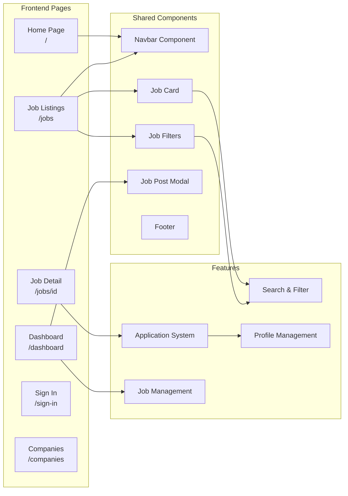
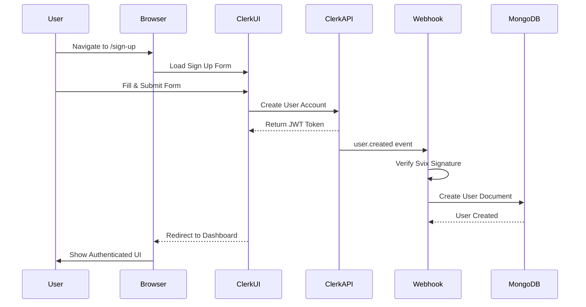
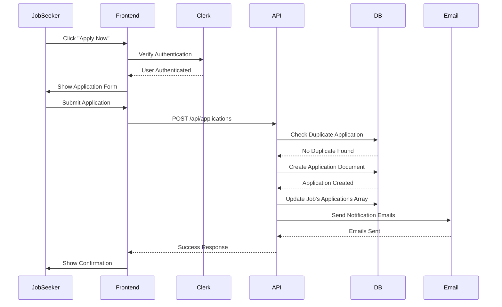
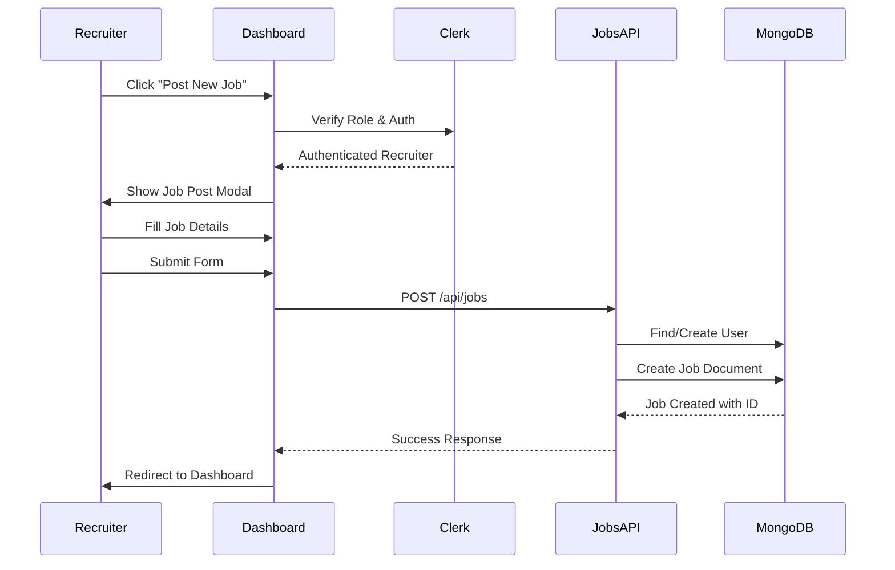
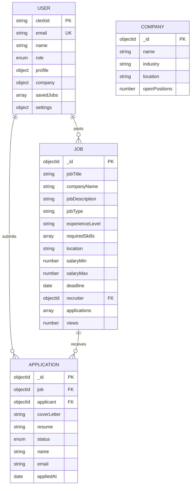
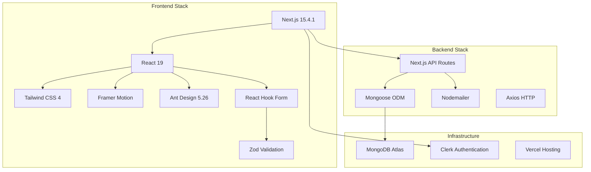
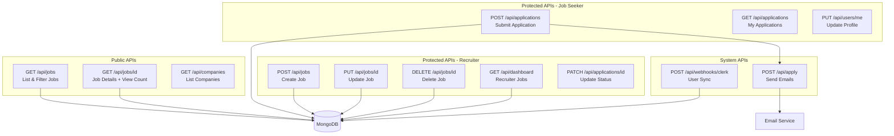
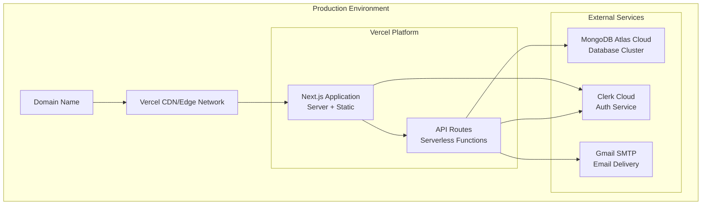
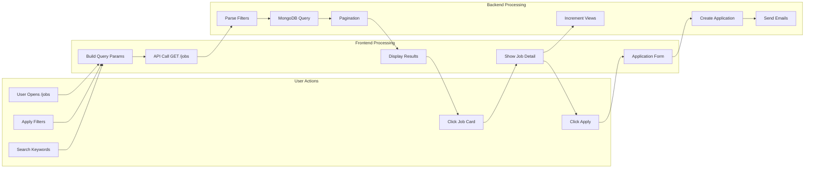

# Job Posting Platform - System Architecture

## High-Level System Architecture Diagram

```mermaid
graph TB
    subgraph "Client Layer"
        Browser[Web Browser]
        Mobile[Mobile Browser]
    end

    subgraph "Frontend - Next.js 15 App"
        Pages[Pages/Routes]
        Components[React Components]
        ClientAuth[Clerk Auth Provider]

        Pages --> |uses| Components
        Pages --> |protected by| ClientAuth
    end

    subgraph "Middleware Layer"
        RouteGuard[Clerk Middleware<br/>Route Protection]
    end

    subgraph "Backend - API Routes"
        JobsAPI[/api/jobs]
        AppsAPI[/api/applications]
        UsersAPI[/api/users]
        DashAPI[/api/dashboard]
        CompAPI[/api/companies]
        WebhookAPI[/api/webhooks/clerk]
        EmailAPI[/api/apply]
    end

    subgraph "External Services"
        Clerk[Clerk Auth Service<br/>clerk.com]
        EmailService[Email Services<br/>Gmail SMTP/Web3Forms]
    end

    subgraph "Database Layer"
        MongoDB[(MongoDB Atlas)]

        subgraph "Collections"
            Users[Users Collection]
            Jobs[Jobs Collection]
            Applications[Applications Collection]
            Companies[Companies Collection]
        end
    end

    Browser --> Pages
    Mobile --> Pages
    Pages --> RouteGuard
    RouteGuard --> JobsAPI
    RouteGuard --> AppsAPI
    RouteGuard --> UsersAPI
    RouteGuard --> DashAPI
    RouteGuard --> CompAPI

    ClientAuth <--> Clerk
    WebhookAPI <--> Clerk

    JobsAPI --> MongoDB
    AppsAPI --> MongoDB
    UsersAPI --> MongoDB
    DashAPI --> MongoDB
    CompAPI --> MongoDB
    WebhookAPI --> Users

    AppsAPI --> EmailAPI
    EmailAPI --> EmailService

    MongoDB --> Users
    MongoDB --> Jobs
    MongoDB --> Applications
    MongoDB --> Companies

    Users -.references.-> Jobs
    Jobs -.references.-> Applications
    Applications -.references.-> Users
```

## Detailed Component Architecture



## Authentication Flow



## Job Application Flow



## Job Posting Flow (Recruiter)



## Database Schema Relationships



## Technology Stack



## API Endpoints Architecture



## Deployment Architecture



## Security Architecture

```mermaid
graph TD
    Request[Incoming Request] --> Middleware{Clerk Middleware}

    Middleware -->|Authenticated| CheckRole{Role Check}
    Middleware -->|Unauthenticated| Public[Public Routes<br/>/, /jobs, /companies]

    CheckRole -->|Job Seeker| JobSeekerRoutes[/api/applications<br/>/api/users/me]
    CheckRole -->|Recruiter| RecruiterRoutes[/api/jobs CRUD<br/>/dashboard<br/>/api/applications/id]
    CheckRole -->|Admin| AdminRoutes[Full Access]

    Public --> Response[Response]
    JobSeekerRoutes --> Validate{Validate Ownership}
    RecruiterRoutes --> Validate
    AdminRoutes --> Response

    Validate -->|Authorized| Response
    Validate -->|Unauthorized| Error[401/403 Error]
```

## Data Flow - Job Search & Apply



---

## Key Architectural Decisions

### 1. **Monolithic Next.js App Router**
- Single codebase for frontend + backend
- Server-side rendering for SEO
- API routes as serverless functions

### 2. **Clerk for Authentication**
- Managed auth service (OAuth, email/password)
- Webhook-based user sync to MongoDB
- JWT-based session management

### 3. **MongoDB as Primary Database**
- Document-based flexible schema
- Easy to scale with embedded documents
- Atlas cloud for managed hosting

### 4. **Role-Based Access Control**
- Three roles: job_seeker, recruiter, admin
- Middleware-level route protection
- API-level authorization checks

### 5. **Email Notifications**
- Dual provider setup (Gmail SMTP + Web3Forms)
- Application confirmations
- Recruiter notifications

### 6. **Responsive Design First**
- Mobile-optimized UI
- Tailwind CSS for utility-first styling
- Framer Motion for smooth interactions

---

## Performance Considerations

- **Pagination**: Jobs API supports page/limit parameters
- **Lean Queries**: MongoDB queries use `.lean()` for better performance
- **Connection Pooling**: Cached MongoDB connections
- **Image Optimization**: Next.js Image component
- **Code Splitting**: Dynamic imports for large components
- **Edge Caching**: Vercel CDN for static assets

## Scalability Roadmap

1. **Phase 1 (Current)**: Monolithic app, single MongoDB instance
2. **Phase 2**: Separate API service, Redis caching
3. **Phase 3**: Microservices (Jobs, Applications, Users)
4. **Phase 4**: Event-driven architecture with message queues

---

**Last Updated**: November 2025
**Version**: 1.0
**Architecture Status**: Production Ready
